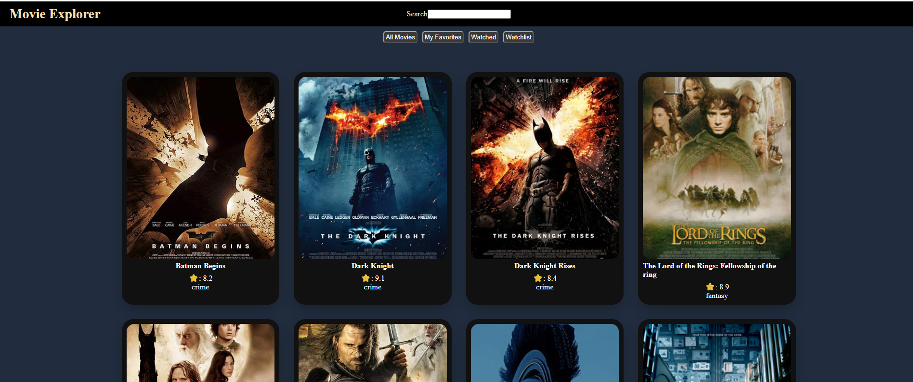
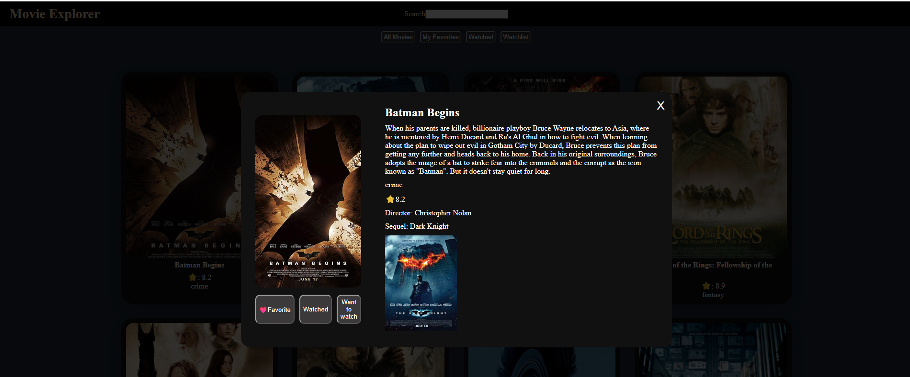
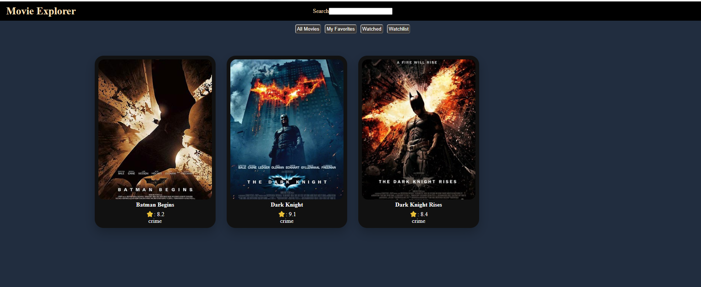

# 🎬 Movie Explorer

Movie Explorer is a responsive movie discovery web application built with HTML, CSS, and JavaScript.

Users can explore movies, search by title or category, view detailed movie information, and organize movies into Favorites, Watched, and Watchlist collections.

Movie information such as IMDb ratings and descriptions is retrieved dynamically using the OMDb API.

## ✨ Features

- 🎬 Browse movie cards
- 🔎 Search movies by title or category
- ⭐ Real IMDb ratings using the OMDb API
- 📝 Movie descriptions fetched from the OMDb API
- 🎥 Movie detail modal
- 🔗 Navigate between movies and their sequels
- ❤️ Add/remove movies from Favorites
- ✅ Add/remove movies from Watched
- 📌 Add/remove movies from Watchlist
- 💾 Lists are saved using LocalStorage
- 📱 Responsive design

## 🛠️ Built With

- HTML5
- CSS3
- JavaScript
- OMDb API
- LocalStorage
- Netlify Functions
- Netlify

## 🔐 API Key Security

The OMDb API key is not exposed in the frontend code.

API requests are routed through a Netlify Function, while the API key is stored securely as a Netlify environment variable.

```text
Browser
   ↓
Netlify Function
   ↓
OMDb API
```

## 📸 Screenshots

### Movie Library



### Movie Details



### Favorites



## 🚀 Live Demo

[View Live Website](https://movieexplorerbyglen.netlify.app/)

## 💻 Source Code

You are currently viewing the source code for Movie Explorer.

## 📚 What I Learned

While building Movie Explorer, I practiced:

- Fetching data from an external API
- Working with async/await and Promises
- Rendering elements dynamically with JavaScript
- Array methods such as `filter()`, `find()`, and `some()`
- Saving and retrieving data with LocalStorage
- Building interactive modal components
- Managing movie relationships using IDs
- Protecting API keys using serverless functions and environment variables
- Deploying a JavaScript project with Netlify

## 👨‍💻 Author

Developed by **ES Web Studio**